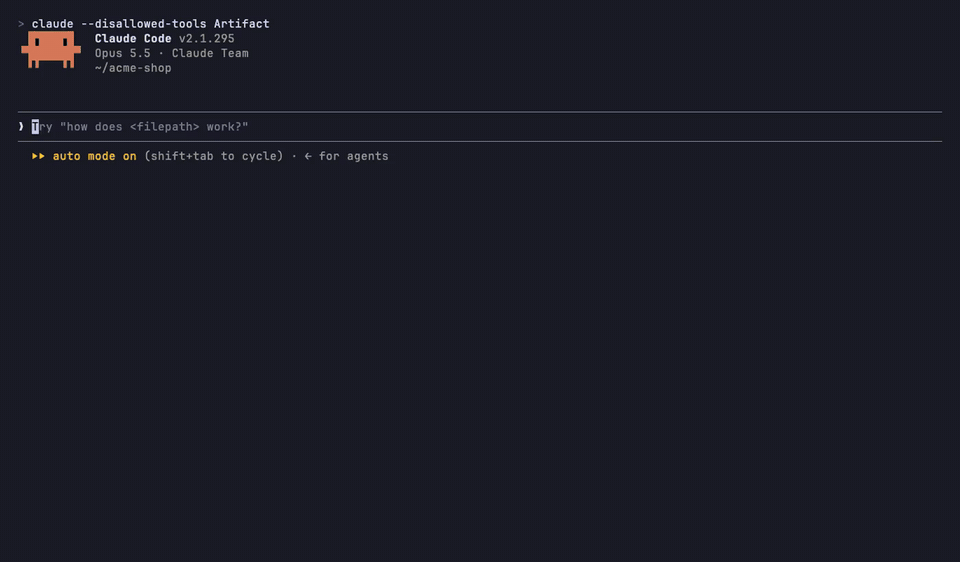
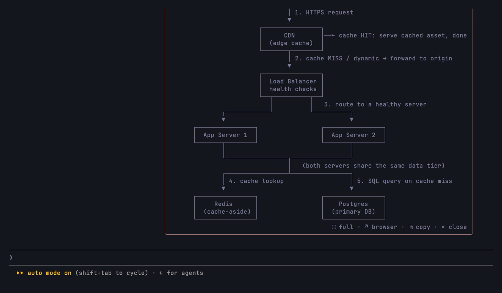
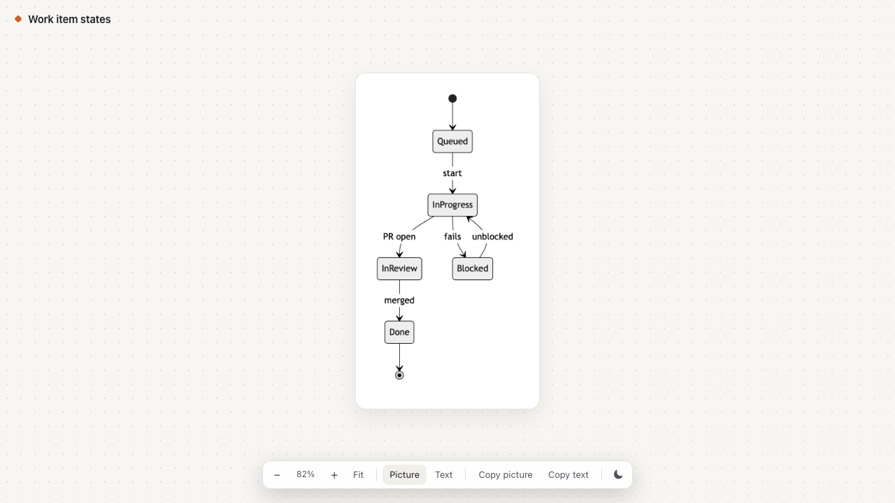
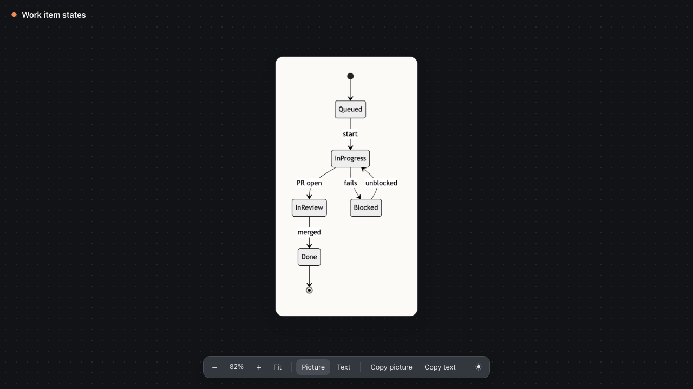

# claude-code-diagrams

**A Claude Code mod for the diagrams Claude draws.** Every box-and-arrow diagram in a reply gets pinned to a small chip above the prompt. Expand it in place, open it full screen, see it as a rendered Mermaid picture, or open it in the browser to zoom, copy and share.



<sub>[Watch the MP4](docs/demo.mp4)</sub>

## Why

If you ask Claude for diagrams often (architecture, request flows, state machines), they scroll away with the chat and are hard to share. This mod keeps them at hand:

- **A chip, not a pane.** A quiet chip on the right above the prompt shows the last diagram's title. While Claude works it shrinks to a pulsing ◆ and stays out of the way.
- **Expand in place.** The card shows the whole diagram, and ‹ prev / next › walks the session's history.
- **Full screen.** The diagram gets a pane of its own, scrolls sideways when it's wide, and zooms your herdr or tmux pane.
- **Pictures.** Claude also writes each diagram in Mermaid, and the mod renders it as a picture in terminals that can show images (kitty, Ghostty, WezTerm).
- **Browser.** A clean, self-contained page with zoom, the picture or the plain text, light and dark themes, and copy buttons.
- **Copy for Slack, GitHub and Notion.** The text is copied fenced, so it stays monospace, and the picture is copied as an image.

| Card above the prompt | Browser, light | Browser, dark |
| --- | --- | --- |
|  |  |  |

## Install

In a Claude Code terminal session:

```
/plugin install diagrams --marketplace tomasvarga/claude-code-diagrams
```

Answer `y` to add the marketplace, pick a scope (user is the default), and set the options on the screen that follows. The mod starts working right away, with no restart.

## Use

- Ask Claude for any diagram. When the reply ends, the chip types in its title.
- Click **expand**, or type `/diagrams`, to open the card. `/diagrams` again closes it.
- The footer has **▦ picture / ⌗ text**, **⛶ full**, **↗ browser**, **⧉ copy** and **✕ close**.
- In the browser, use `+` and `−`, pinch or ctrl+scroll to zoom, `0` or **Fit** to fit, and drag to pan.

## Settings

Change them with `/config` → **diagrams**.

| Setting | Values | What it does |
| --- | --- | --- |
| **Palette** | `terminal` (default), `solarized-light`, `solarized-dark` | `terminal` uses your terminal's own colors. A preset paints the card in fixed colors, whatever Claude Code's theme is. |
| **Full screen palette** | `same` (default), `solarized-light`, `solarized-dark` | Gives only the full-screen pane its own palette. |
| **Pictures** | `on` (default), `off` | Claude adds a Mermaid version of each diagram, and the mod renders it as a picture. `off` keeps replies shorter and skips the renderer. |

## Pictures

The mod renders Mermaid using `mmdc` if it's installed. Otherwise it uses the pinned `@mermaid-js/mermaid-cli` through `npx`. The first render downloads the renderer and a headless Chrome, which takes about a minute. After that, a render takes about a second.

The picture shows in terminals that speak the kitty graphics protocol: kitty, Ghostty and WezTerm. Elsewhere the card shows the text.

## Terminal notes

- **Mouse clicks** reach the mod's buttons only in Claude Code's fullscreen mode: `/config` → renderer → fullscreen, or `"tui": "fullscreen"` in settings. In the default mode, use `/diagrams` to open and close the card.
- **Pictures inside herdr or tmux:** the multiplexer hides which terminal you're in, so Claude Code assumes it can't draw pictures. Turn them on with:

  ```sh
  export CLAUDE_CODE_FORCE_TERMINAL_IMAGES=1
  ```

  herdr also needs `kitty_graphics = true` in its config.
- **Full screen** zooms the current herdr or tmux pane and puts it back on close, so a crowded split gets the whole window.

## What it does on your machine

The mod runs inside Claude Code's mod sandbox and reaches the outside only through these calls:

- It adds a short section to the system prompt that asks Claude to draw diagrams in fenced blocks with a title, plus Mermaid when Pictures is on.
- It writes `claude-diagram-*.mmd`, `.png` and `.html` files to your temp folder (`$TMPDIR`).
- It runs `mmdc`, or `npx @mermaid-js/mermaid-cli`, to render pictures; `open` or `xdg-open` for the browser view; `osascript` or `xclip` to copy a picture; and `herdr` or `tmux` to zoom the pane.
- It sends nothing over the network. The only exception is the one-time `npx` download of the Mermaid renderer.

## Develop

```sh
git clone https://github.com/tomasvarga/claude-code-diagrams
claude --plugin-dir ./claude-code-diagrams     # run Claude Code with it
claude plugin validate ./claude-code-diagrams  # check what the engine would accept
claude plugin test ./claude-code-diagrams      # run the tests
```

The mod is one module, [`hooks/register.tsx`](hooks/register.tsx). Its state contract is in [`types/index.d.ts`](types/index.d.ts), and the tests are in [`tests/`](tests/).

## License

[MIT](LICENSE)
